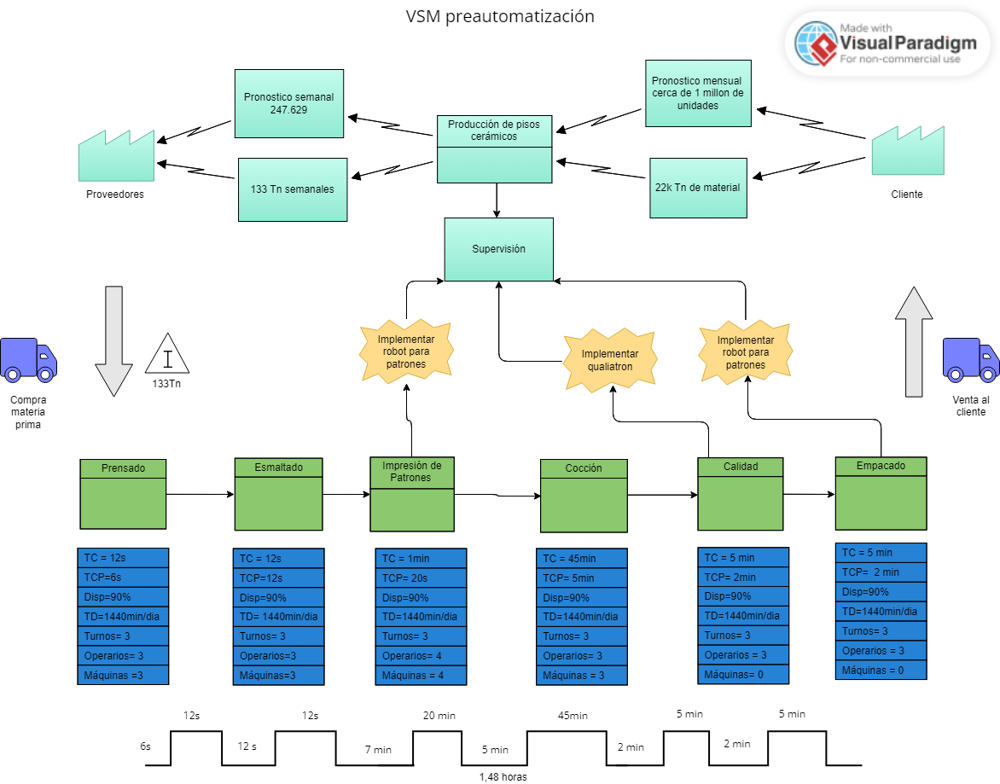
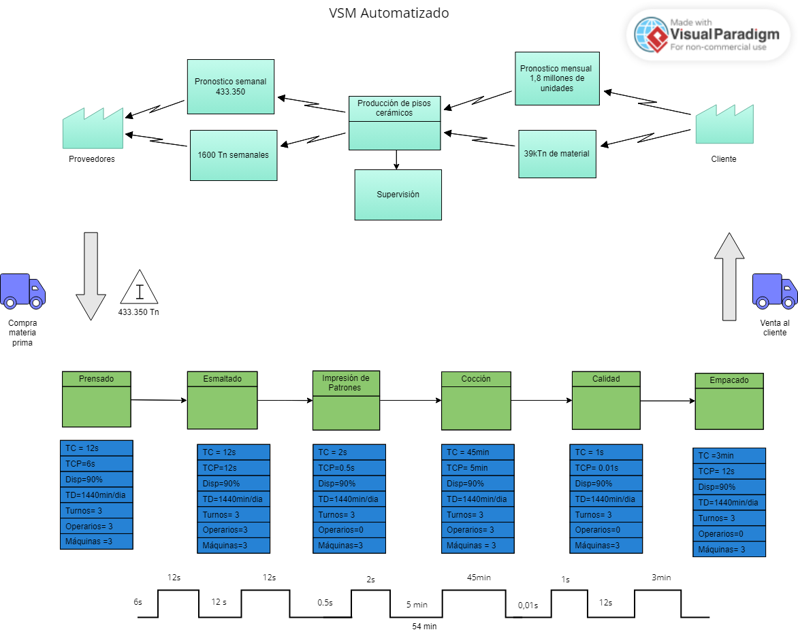
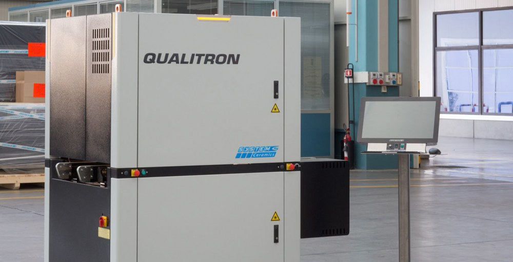

# Propuesta de automatización para la industria cerámica - Chía Dynamics :factory:

## Objetivos

## Contextualización del proyecto

## 1.1.2.1.3 KPI's Planteados
La información correspondiente se encuentra dentro de la carpeta:
    1. Sección de Producto
        1.1 Gestión de Proyecto
        
## 1.3. Planeación del Proyecto (7 Pasos y Cronograma)
### EDT

### Adquisiciones

### Costo y Tiempos

### Riesgos

### Stakeholders

### Matriz de Comunicaciones

### RACI

## VSM
  Se realizaron  2 VSM para el proceso pre automatización y automatizado, como se ven en las siguientes figuras:
  
  

  Las etapas a automatizar se asumieron que se realizan sin ningún tipo de automatización.
  
## Business Model Canvas

Inicialmente se propone el siguiene Business Model Canvas para la empresa que constituimos para el proyecto:

## 1.4 Evaluación económica del proyecto

### 1.4.1.	Excel con indicadores financieros completado.

### 1.4.1.1.	 VPN calculado.

### 1.4.1.2.	 TIR calculada.

### 1.4.1.3.	 Payback calculado.

### 1.4.2.	Oferta comercial escrita.

Teniendo en cuenta los gastos necesarios para la compra de las máquinarias necesarias para la actualización junto con los diversos implementos de control y de seguridad, se puede observar que en 5 meses se obtiene un payback mayor al costo de inversión, generando en 12 meses más de 700.000.000 de beneficio.

## Primera propuesta de layout

## Partes del proceso que serán automatizadas

## Propuesta inicial de automatización
Se seleccionaron la impresion de patrones, el proceso de calidad del producto y el embalaje como los procesos a automatizar. Luego de investigar respecto a soluciones similares en la industria, se llegaorn a las siguientes conclusiones:
#### Impresion de patrones
 Implentacion de máquina impresora de patrones, como la que se presenta a continuación:
 
 Esta máquina posee las siguientes caracteristicas:
- Velocidad de hasta 70 m/min
- Hasta 12 barras de color
- Circuito de color con recirculación múltiple
- Circuito de aducción de color
- Montaje óptico de los cabezales
- Software de perfilación
- Limpieza cada 4 horas

#### Calidad del producto
Se busca realizar con el uso de un Qualitron, dadas las siguentes características:
- cámaras de 6000 puntos
- zona de cámara oscura, sellada
- iluminador IR de 4° generación
El qualitron que busca implementar es el que puede verse a continuacion, (o si bien un modelo similar):

#### Embalaje de cajas

El proceso de embalaje de cajas se dividirá en 5 fases distintas. Esto contemplara el proceso desde el armado de la caja y la deposición de las baldosas en su imterior hasta el posicionamiento de las cajas y su cobertura de vinipel:

- Doblado inicial de la caja: En esta etapa partimos de la caja desarmada completamente y a través de una máquina le daremos el formado respectivo para poner posteriormente las lozas.
- Posicionamiento de las cerámicas dentro de la caja: Una vez armada la caja se dispondrá de un brazo que posicionará doce baldosas en cada caja mientras se mueven por una línea transportadora.
- Cierre de la caja: En esta etapa se dispondrá de una máquina que pondrá pegamento doblará los bordes restantes para el sellado de la caja con el fin de terminar el producto que se enviará.
- Posicionamiento de las cajas: Las cajas se ubican de acuerdo con la distribución definida para el transporte de las baldosas.
- Embalaje del conjunto de cajas: Una máquina pondrá finalmente el vinipel para mantener fijas las cajas y protegerlas para el transporte.
 

### Robots propuestos para cada parte del proceso

## 1.5.4 Análisis de riesgo y peligros
La información correspondiente se encuentra dentro de la carpeta:
    1.5 Sección de producto
        1.5 Contenido de módulo de celda de manufactura robotizada completado
        
